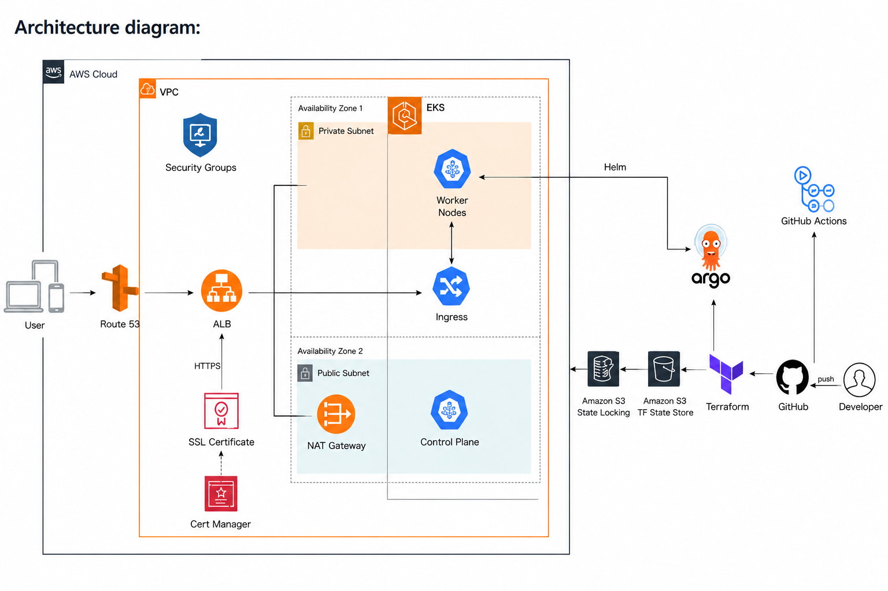
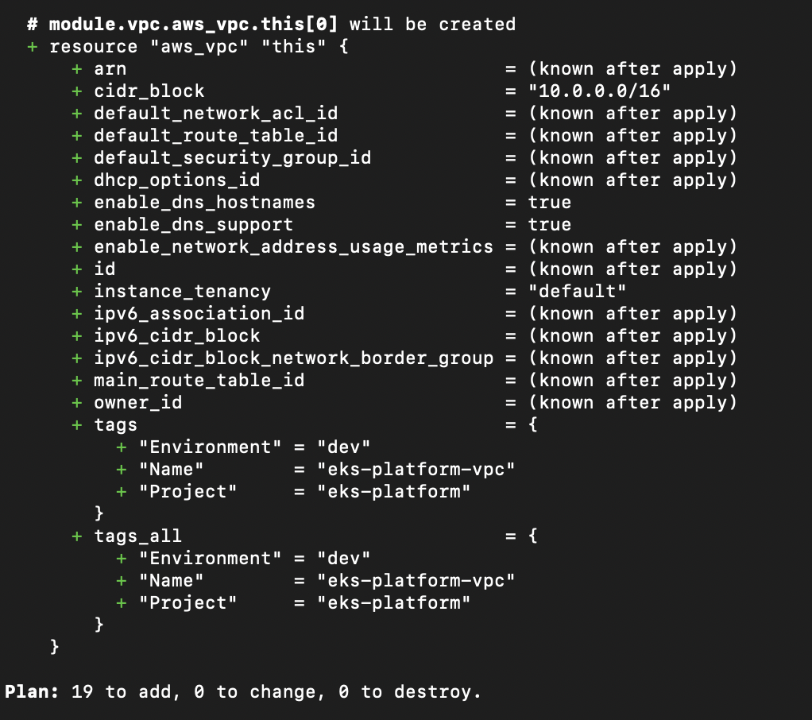
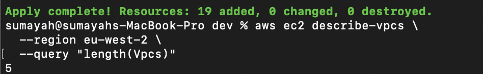
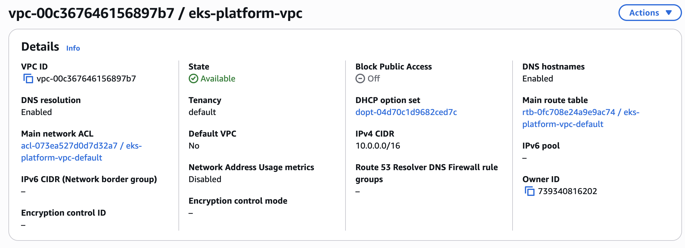
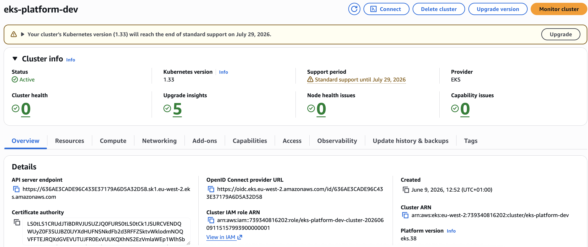
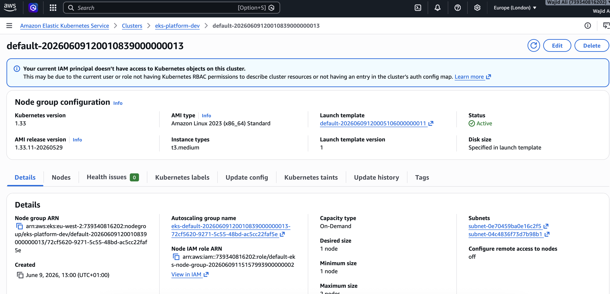
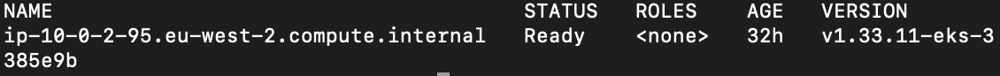
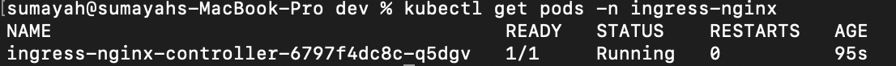
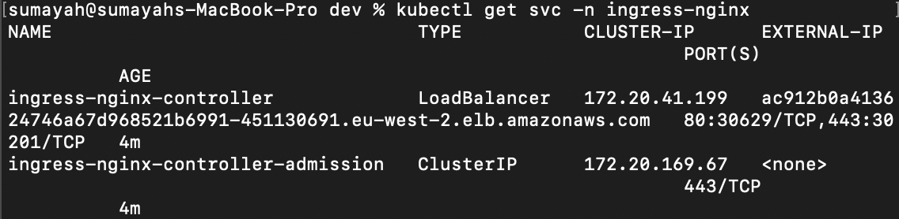
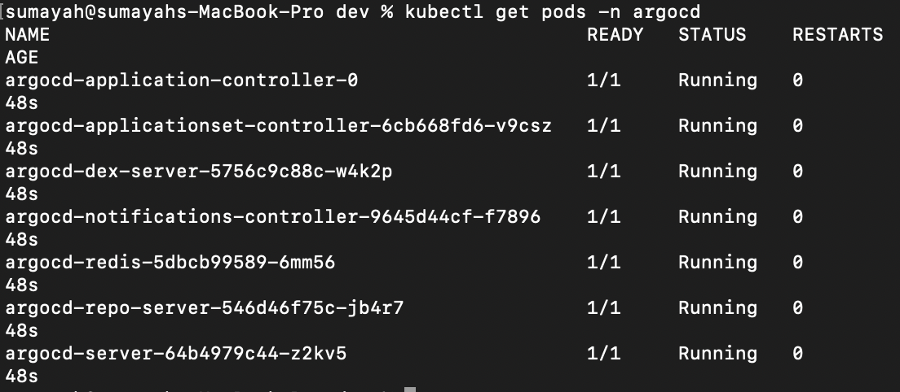

## Architecture

The following diagram illustrates the complete platform architecture, including AWS infrastructure, EKS, GitOps workflows, CI/CD pipelines, DNS automation, TLS certificate management, and observability components.

<p align="center">
  
</p>

### Key Components

#### AWS Infrastructure
- VPC with public and private subnets
- Amazon EKS cluster
- Managed node groups
- Security groups and IAM roles
- Route53 hosted zone
- Amazon ECR container registry

#### Kubernetes Platform
- NGINX Ingress Controller
- Cert-Manager
- ExternalDNS
- Application workloads
- Services and Ingress resources

#### GitOps & CI/CD
- GitHub Actions for automation
- Terraform for Infrastructure as Code
- ArgoCD for continuous deployment
- Amazon S3 backend for Terraform state
- DynamoDB state locking

#### Monitoring & Observability
- Prometheus metrics collection
- Grafana dashboards
- Kubernetes health monitoring
- Application performance monitoring

---

## Architecture Flow

```text
Developer
    │
    ▼
GitHub Repository
    │
    ▼
GitHub Actions
    │
    ├── Terraform Infrastructure Deployment
    ├── Docker Image Build
    ├── Trivy Security Scan
    └── Push Image to ECR
            │
            ▼
         ArgoCD
            │
            ▼
      Amazon EKS
            │
            ▼
 NGINX Ingress Controller
            │
            ▼
        Application
            │
            ▼
         End Users

Route53 + ExternalDNS
            │
            ▼
 Dynamic DNS Updates

Cert-Manager
            │
            ▼
 Automated TLS Certificates

Prometheus
            │
            ▼
Grafana Dashboards
```

---

# 🚀 Implementation 

This section documents the project build process and key milestones completed throughout the deployment.

## Phase 1: Infrastructure Foundation

### Terraform Backend Configuration

Configured remote Terraform state management using:

- Amazon S3 for Terraform state storage
- DynamoDB for state locking
- State encryption enabled
- Versioning enabled for recovery and auditing

---

### VPC Deployment Plan

Terraform plan showing the networking resources that will be provisioned before deployment.

**Resources Included:**

- VPC
- Public Subnets
- Private Subnets
- Internet Gateway
- NAT Gateway
- Route Tables



---

### VPC Deployment Success

Successful deployment of the AWS networking layer.

**Provisioned Resources:**

- VPC
- Public Subnets
- Private Subnets
- NAT Gateway
- Internet Gateway
- Route Tables



---

## AWS Infrastructure

### VPC Overview

Production-ready VPC provisioned using Terraform.

**Configuration:**

| Component | Value |
|------------|---------|
| CIDR Block | 10.0.0.0/16 |
| DNS Resolution | Enabled |
| DNS Hostnames | Enabled |
| Environment | Dev |
| Project | eks-platform |



---

## Infrastructure Structure

The following components will be implemented in the next phases:

### Amazon EKS

- EKS Control Plane
- Managed Node Groups
- IAM Roles for Service Accounts (IRSA)

## Amazon EKS

### EKS Cluster Deployment

Successfully provisioned an Amazon EKS cluster using Terraform.

**Provisioned Components**

- Amazon EKS Control Plane
- Managed Node Group
- Worker Node
- Cluster IAM Roles
- OIDC Provider
- Security Groups
- EKS Access Entries

**Cluster Details**

| Component | Value |
|------------|---------|
| Cluster Name | eks-platform-dev |
| Kubernetes Version | 1.33 |
| Node Group Type | Managed |
| Instance Type | t3.medium |
| Desired Capacity | 1 |
| Region | eu-west-2 |



---

### EKS Managed Node Group

Successfully provisioned an Amazon EKS Managed Node Group using Terraform.

The node group provides the compute capacity required to run Kubernetes workloads within the cluster. AWS automatically manages node lifecycle operations including provisioning, updates, and health monitoring.

**Node Group Configuration**

| Component | Value |
|------------|---------|
| Node Group Name | default |
| Instance Type | t3.medium |
| Capacity Type | On-Demand |
| Desired Nodes | 1 |
| Minimum Nodes | 1 |
| Maximum Nodes | 2 |
| Management Type | EKS Managed Node Group |

**Deployment Outcome**

- Managed node group created successfully
- EC2 worker node launched automatically
- Node joined the EKS cluster
- Ready to host Kubernetes workloads
- Scalable through Terraform configuration




### Kubernetes cluster verified operational

Validated cluster connectivity and worker node registration using kubectl.





### Kubernetes Platform Services

- NGINX Ingress Controller
- CertManager
- ExternalDNS

### Kubernetes Connectivity Validation

Validated connectivity to the Amazon EKS cluster using kubectl and confirmed that the worker node successfully joined the cluster.

**Validation Commands**


**Validation Results**

- kubectl successfully authenticated against the EKS API server
- Current context points to the `eks-platform-dev` cluster
- Worker node registered successfully
- Node status reported as `Ready`
- Cluster is ready to host Kubernetes workloads


### AWS Load Balancer Provisioning

The NGINX Ingress Controller automatically provisioned an AWS Load Balancer through the Kubernetes Service of type LoadBalancer.

**Capabilities:**

- Public application entry point
- Automatic AWS integration
- Traffic routing to Kubernetes services
- Foundation for DNS and TLS automation

### NGINX Ingress Controller



### NGINX AWS Load Balancer Validation



### GitOps

- ArgoCD
- Application Sync
- Automated Deployments


### ArgoCD Deployment

ArgoCD was deployed into the Amazon EKS cluster to provide GitOps-based continuous delivery.

The platform continuously monitors Git repositories and synchronizes Kubernetes resources to the desired state defined in source control.

### Deployed components include:

- ArgoCD API Server
- Repository Server
- Application Controller
- ApplicationSet Controller
- Redis
- Dex Authentication Service

All ArgoCD pods successfully reached the Running state after deployment.




### CI/CD

- Terraform Pipeline
- Checkov Security Scanning
- Docker Build Pipeline
- Trivy Image Scanning

### Monitoring

- Prometheus
- Grafana
- Kubernetes Dashboards

---