## Architecture

The following diagram illustrates the complete platform architecture, including AWS infrastructure, EKS, GitOps workflows, CI/CD pipelines, DNS automation, TLS certificate management, and observability components.

<p align="center">
  
</p>

### Key Components

#### AWS Infrastructure
- VPC with public and private subnets
- Amazon EKS cluster
- Managed node groups
- Security groups and IAM roles
- Route53 hosted zone
- Amazon ECR container registry

#### Kubernetes Platform
- NGINX Ingress Controller
- Cert-Manager
- ExternalDNS
- Application workloads
- Services and Ingress resources

#### GitOps & CI/CD
- GitHub Actions for automation
- Terraform for Infrastructure as Code
- ArgoCD for continuous deployment
- Amazon S3 backend for Terraform state
- DynamoDB state locking

#### Monitoring & Observability
- Prometheus metrics collection
- Grafana dashboards
- Kubernetes health monitoring
- Application performance monitoring

---

## Architecture Flow

```text
Developer
    │
    ▼
GitHub Repository
    │
    ▼
GitHub Actions
    │
    ├── Terraform Infrastructure Deployment
    ├── Docker Image Build
    ├── Trivy Security Scan
    └── Push Image to ECR
            │
            ▼
         ArgoCD
            │
            ▼
      Amazon EKS
            │
            ▼
 NGINX Ingress Controller
            │
            ▼
        Application
            │
            ▼
         End Users

Route53 + ExternalDNS
            │
            ▼
 Dynamic DNS Updates

Cert-Manager
            │
            ▼
 Automated TLS Certificates

Prometheus
            │
            ▼
Grafana Dashboards
```

---

# 🚀 Implementation 

This section documents the project build process and key milestones completed throughout the deployment.

## Phase 1: Infrastructure Foundation

### Terraform Backend Configuration

Configured remote Terraform state management using:

- Amazon S3 for Terraform state storage
- DynamoDB for state locking
- State encryption enabled
- Versioning enabled for recovery and auditing

---

### VPC Deployment Plan

Terraform plan showing the networking resources that will be provisioned before deployment.

**Resources Included:**

- VPC
- Public Subnets
- Private Subnets
- Internet Gateway
- NAT Gateway
- Route Tables


---

### VPC Deployment Success

Successful deployment of the AWS networking layer.

**Provisioned Resources:**

- VPC
- Public Subnets
- Private Subnets
- NAT Gateway
- Internet Gateway
- Route Tables


---

## AWS Infrastructure

### VPC Overview

Production-ready VPC provisioned using Terraform.

**Configuration:**

| Component | Value |
|------------|---------|
| CIDR Block | 10.0.0.0/16 |
| DNS Resolution | Enabled |
| DNS Hostnames | Enabled |
| Environment | Dev |
| Project | eks-platform |


---

## Infrastructure Structure

The following components will be implemented in the next phases:

### Amazon EKS

- EKS Control Plane
- Managed Node Groups
- IAM Roles for Service Accounts (IRSA)

## Amazon EKS

### EKS Cluster Provisioned

Successfully provisioned an Amazon Elastic Kubernetes Service (EKS) cluster using Terraform.

The deployment created a fully managed Kubernetes control plane integrated with AWS networking, IAM, and security services.

#### Provisioned Components

- Amazon EKS Control Plane
- Managed Node Group
- Worker Node
- Cluster IAM Roles
- OIDC Provider
- Security Groups
- EKS Access Entries

#### Cluster Details

| Component | Value |
|------------|---------|
| Cluster Name | eks-platform-dev |
| Kubernetes Version | 1.33 |
| Region | eu-west-2 |
| Provider | Amazon EKS |
| Platform Version | eks.38 |
| Node Group Type | Managed |
| Instance Type | t3.medium |
| Desired Capacity | 1 |
| Status | Active |

#### Validation

- Cluster successfully provisioned
- Kubernetes control plane operational
- No cluster health issues detected
- No node health issues detected
- Ready for Kubernetes workload deployment

The screenshot below confirms that the Amazon EKS cluster reached an **Active** state and successfully passed AWS health validation checks.

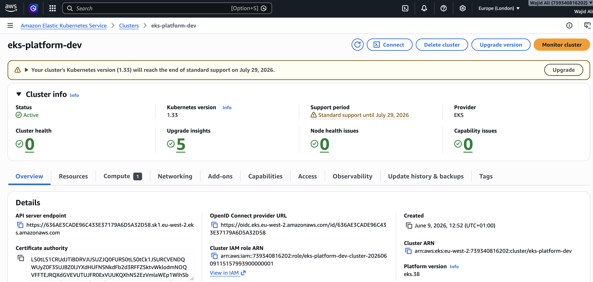

---

### EKS Managed Node Group

Successfully provisioned an Amazon EKS Managed Node Group using Terraform.

The node group provides the compute capacity required to run Kubernetes workloads within the cluster. AWS automatically manages node lifecycle operations including provisioning, updates, and health monitoring.

**Node Group Configuration**

| Component | Value |
|------------|---------|
| Node Group Name | default |
| Instance Type | t3.medium |
| Capacity Type | On-Demand |
| Desired Nodes | 1 |
| Minimum Nodes | 1 |
| Maximum Nodes | 2 |
| Management Type | EKS Managed Node Group |

**Deployment Outcome**

- Managed node group created successfully
- EC2 worker node launched automatically
- Node joined the EKS cluster
- Ready to host Kubernetes workloads
- Scalable through Terraform configuration


### Kubernetes cluster verified operational

Validated cluster connectivity and worker node registration using kubectl.


### Kubernetes Platform Services

- NGINX Ingress Controller
- CertManager
- ExternalDNS

### Kubernetes Connectivity Validation

Validated connectivity to the Amazon EKS cluster using kubectl and confirmed that the worker node successfully joined the cluster.

**Validation Commands**


**Validation Results**

- kubectl successfully authenticated against the EKS API server
- Current context points to the `eks-platform-dev` cluster
- Worker node registered successfully
- Node status reported as `Ready`
- Cluster is ready to host Kubernetes workloads


### AWS Load Balancer Provisioning

The NGINX Ingress Controller automatically provisioned an AWS Load Balancer through the Kubernetes Service of type LoadBalancer.

**Capabilities:**

- Public application entry point
- Automatic AWS integration
- Traffic routing to Kubernetes services
- Foundation for DNS and TLS automation

### NGINX Ingress Controller


### NGINX AWS Load Balancer Validation


### GitOps

- ArgoCD
- Application Sync
- Automated Deployments


### ArgoCD Deployment

ArgoCD was deployed into the Amazon EKS cluster to provide GitOps-based continuous delivery.

The platform continuously monitors Git repositories and synchronizes Kubernetes resources to the desired state defined in source control.

### Deployed components include:

- ArgoCD API Server
- Repository Server
- Application Controller
- ApplicationSet Controller
- Redis
- Dex Authentication Service

All ArgoCD pods successfully reached the Running state after deployment.


### ArgoCD Service Exposure

The ArgoCD API server was exposed through an AWS Load Balancer, providing secure access to the GitOps dashboard.

The load balancer endpoint allows administrators to manage application deployments, monitor synchronization status, and control Kubernetes resources through the ArgoCD web interface.

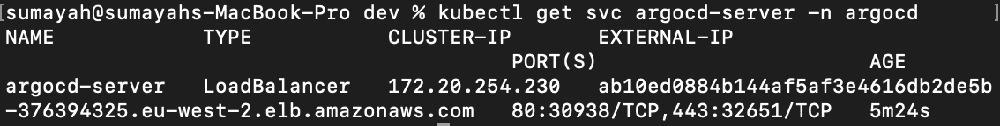


---

### ArgoCD Login Interface

After exposing the ArgoCD API server through an AWS Load Balancer, the web interface became accessible externally.

Authentication was performed using the initial administrator credentials generated during installation.

This validates successful deployment of the ArgoCD control plane and confirms external connectivity to the GitOps platform.

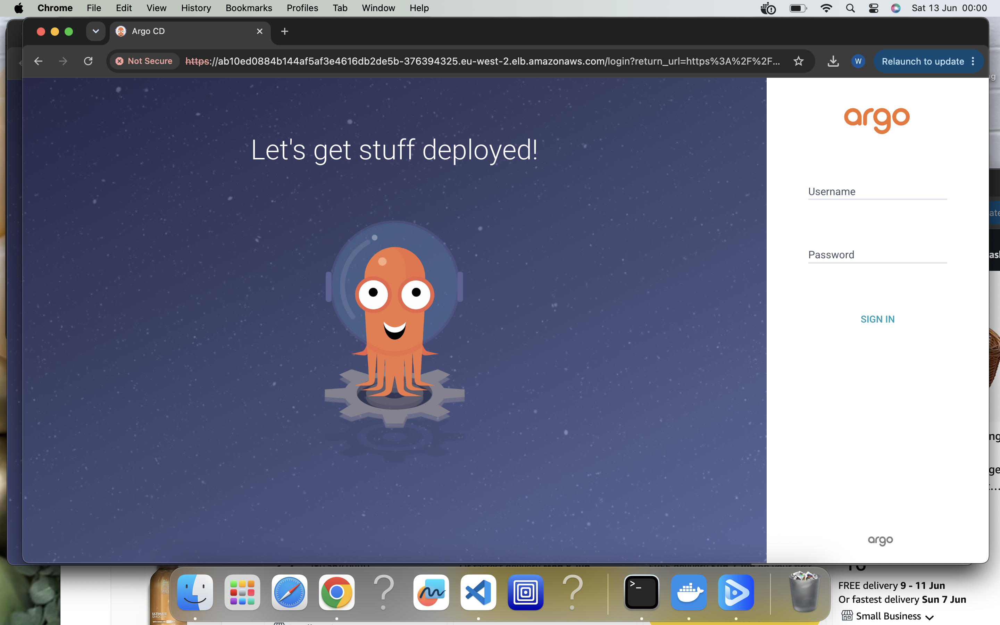

---

### ArgoCD Dashboard

Following successful authentication, the ArgoCD dashboard provides centralized visibility into:

- Applications
- Projects
- Kubernetes Clusters
- Git Repositories
- Deployment Health Status
- Synchronization State

The dashboard serves as the GitOps control plane for managing Kubernetes workloads and automating application delivery from source control.

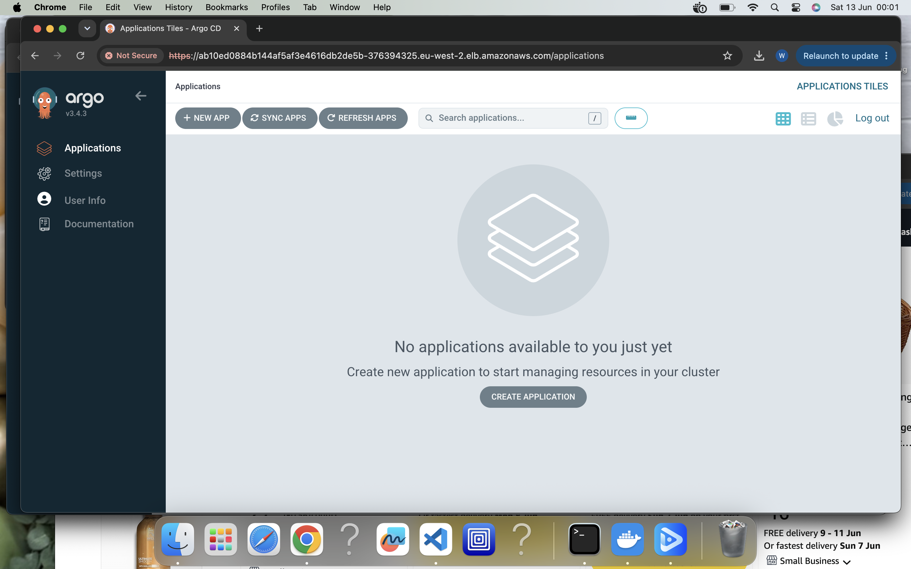

---

### GitOps Application Sync

ArgoCD continuously monitored the Git repository and automatically reconciled cluster state with the desired configuration stored in source control.

The NGINX application was deployed entirely through GitOps workflows. After committing Kubernetes manifests to GitHub, ArgoCD detected the changes, synchronized the application, and deployed the workload into the EKS cluster.

Features demonstrated:

- GitOps continuous reconciliation
- Automated Kubernetes deployments
- Application health monitoring
- Declarative infrastructure management
- GitHub to Kubernetes deployment pipeline

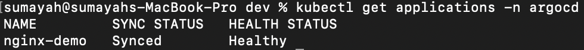

### Automated Deployment Verification

The deployed workload was successfully synchronized and reached a healthy operational state. Kubernetes reported all application pods as running and the ingress endpoint was successfully provisioned.

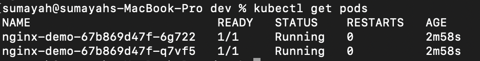

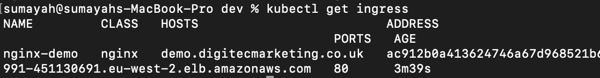


### CI/CD

- Terraform Pipeline
- Checkov Security Scanning
- Docker Build Pipeline
- Trivy Image Scanning

---

# CI/CD Automation

Continuous Integration and Continuous Delivery (CI/CD) processes are implemented using GitHub Actions.

The automation pipeline validates infrastructure changes, enforces consistency across environments, and provides a repeatable deployment workflow for the EKS platform.

## GitHub Actions Workflow

A dedicated Terraform CI workflow has been configured within the repository.

The workflow automatically executes when changes are pushed to the main branch, ensuring infrastructure code is validated before deployment activities are performed.

### Pipeline Objectives

- Infrastructure as Code validation
- Automated Terraform execution
- Consistent deployment process
- Git-based workflow automation
- Continuous infrastructure testing

### Workflow Benefits

- Reduces manual deployment effort
- Detects infrastructure issues early
- Maintains deployment consistency
- Provides deployment history and auditability
- Supports GitOps operating practices


### GitHub Actions Automation

GitHub Actions is used to automate infrastructure validation and deployment workflows.

The Terraform CI workflow executes automatically on commits to the main branch, ensuring infrastructure changes are validated before deployment.

The workflow history below demonstrates multiple successful executions of the CI pipeline.


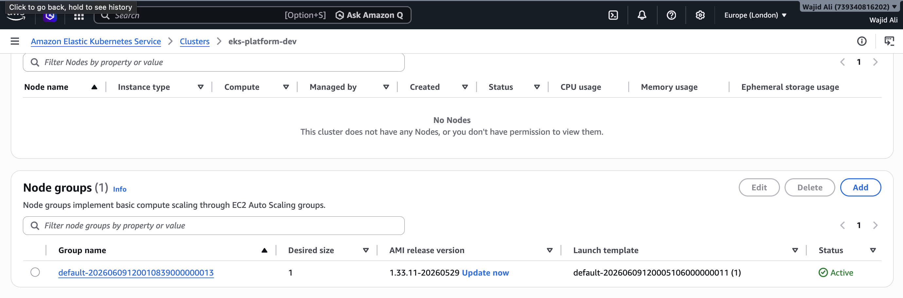


### Terraform CI Workflow Definition

Terraform infrastructure validation is automated using GitHub Actions and defined as code within the repository.

The workflow is configured to execute whenever changes are pushed to the repository, providing a repeatable and consistent CI/CD process for Infrastructure as Code (IaC) deployments.

The workflow definition below demonstrates how Terraform automation is implemented using GitHub Actions, including workflow triggers, execution environment, and job configuration.

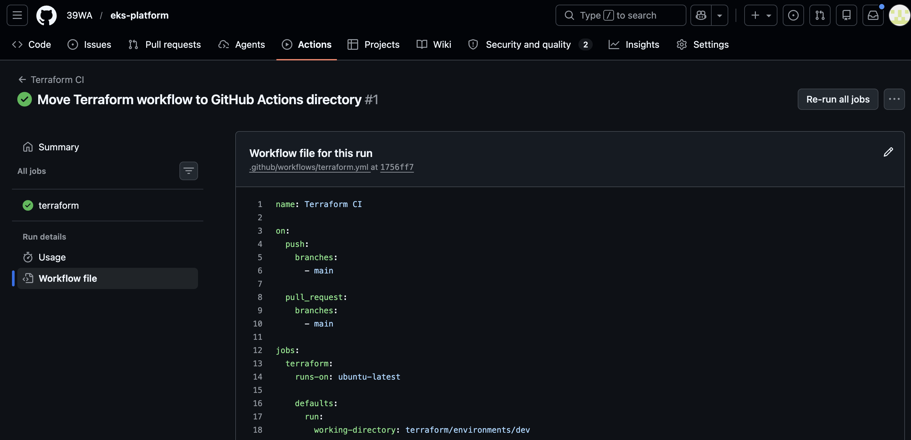

### Terraform CI Execution

Terraform infrastructure validation is executed automatically through GitHub Actions.

The workflow runs whenever changes are pushed to the repository, providing automated execution and deployment consistency for Infrastructure as Code (IaC) operations.

The successful workflow run below demonstrates the automated Terraform pipeline executing within GitHub Actions.

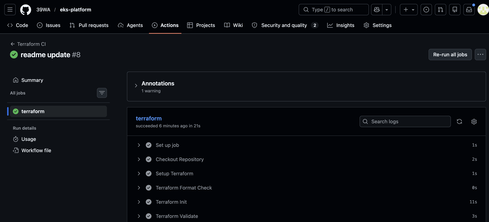

### Terraform Validation Pipeline

Infrastructure as Code validation is automated through GitHub Actions.

Every push to the repository triggers a CI pipeline that performs Terraform validation and security checks before infrastructure changes are applied.

The pipeline provides early detection of configuration issues and helps enforce Infrastructure as Code best practices.

**Pipeline Stages**

- Checkout Repository
- Setup Terraform
- Terraform Format Check
- Terraform Init
- Terraform Validate
- Checkov Security Scan
- Complete Job

**Validation Outcome**

- Terraform configuration validated successfully
- Infrastructure syntax verified
- Code formatting enforced
- Security scanning executed automatically
- CI pipeline completed successfully

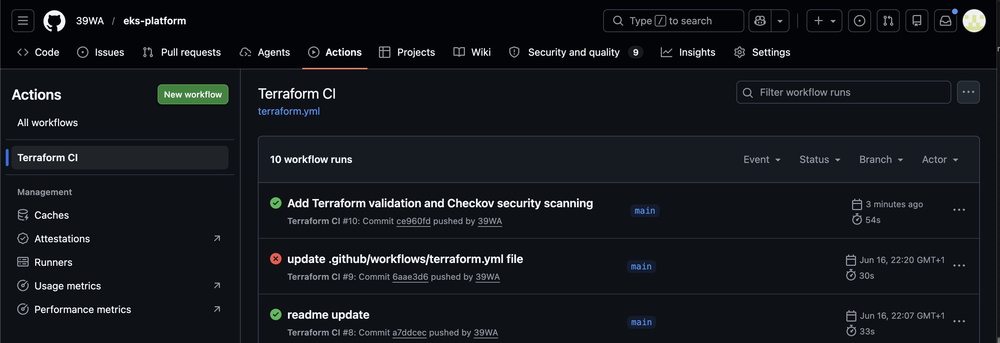

### Infrastructure Security Scanning

Infrastructure security validation is integrated directly into the CI/CD pipeline using Checkov.

Checkov automatically scans Terraform configurations for security misconfigurations, compliance violations, and Infrastructure as Code (IaC) best-practice violations during every workflow execution.

This ensures that infrastructure changes are validated before deployment and helps enforce secure cloud architecture standards.

**Security Controls**

- Terraform misconfiguration detection
- Infrastructure security validation
- Compliance rule checking
- Automated security feedback
- Shift-left security integration
- Continuous Infrastructure as Code scanning

**Security Outcome**

- Terraform code scanned successfully
- Security validation executed automatically
- Infrastructure compliance checks performed
- Security controls integrated into GitHub Actions
- CI/CD security gates verified

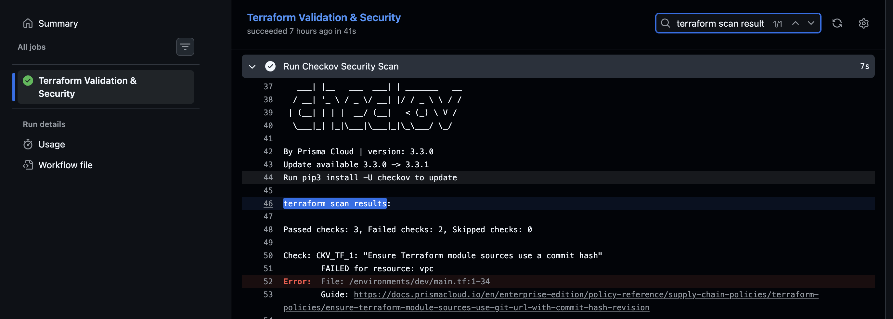


### Secure Secret Management

GitHub Actions secrets provide secure storage for sensitive configuration values used during CI/CD execution. Secrets are encrypted and injected into workflows at runtime, preventing credentials and sensitive data from being exposed within source code.

**Security Features**

- Encrypted secret storage
- Runtime credential injection
- Separation of configuration from code
- Secure CI/CD execution
- Protection of sensitive values

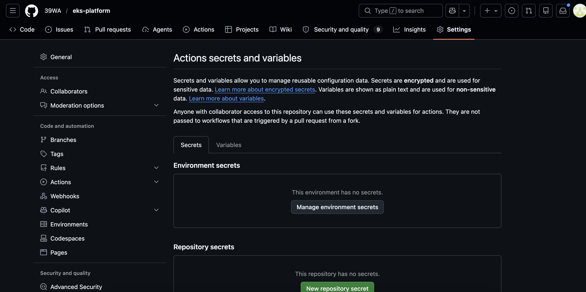


### Checkov Security Findings

Checkov performs policy-based scanning against Terraform code and provides immediate feedback during CI/CD execution. The scan identified resources that violate supply-chain best practices by using version constraints instead of immutable commit hashes for Terraform module sources.

**Security Controls Enforced**

- Infrastructure as Code (IaC) security scanning
- Policy-based compliance validation
- Terraform module source verification
- Early detection of configuration issues
- Continuous security feedback during deployment pipelines

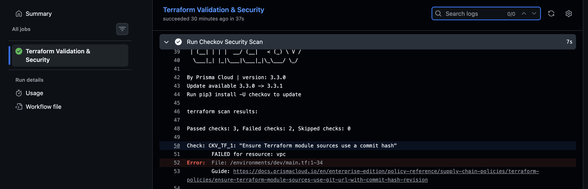


### Checkov Security Findings

Checkov performs Infrastructure-as-Code (IaC) security scanning during CI/CD execution and provides policy-based validation of Terraform resources. The scan identified supply-chain security findings by enforcing immutable Terraform module sources and highlighting configuration issues early in the deployment pipeline.

**Security Capabilities**

- Static analysis of Terraform code
- Policy-as-Code enforcement
- Continuous security validation
- Supply-chain security checks
- Early detection of configuration risks


### Figure 24. Terraform plan for scaling the EKS managed node group

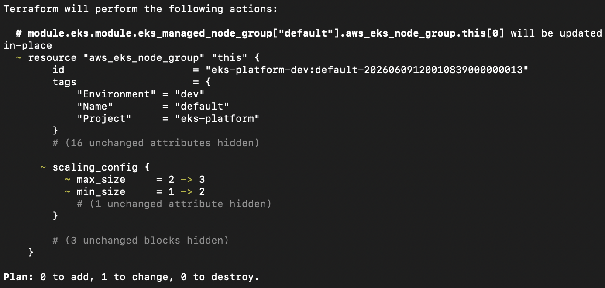

Terraform generated an execution plan to increase the capacity of the EKS managed node group. The plan updated the scaling configuration, increasing the minimum size from one to two nodes and the maximum size from two to three nodes. This change was required to provide sufficient resources for deploying the Prometheus and Grafana monitoring stack.

**Planned changes:**

- `min_size`: 1 → 2
- `max_size`: 2 → 3
- Resources to add: 0
- Resources to change: 1
- Resources to destroy: 0

### Figure 23. Monitoring pods remained in a pending state due to insufficient cluster capacity

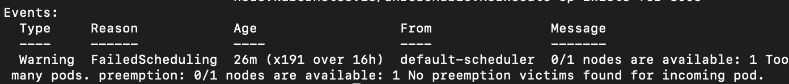

Inspection of the Prometheus pod events revealed repeated `FailedScheduling` warnings. Kubernetes reported that no additional capacity was available on the cluster and that the incoming pods could not be scheduled. This indicated that the single-node EKS cluster lacked sufficient resources to host the monitoring stack and motivated scaling the managed node group.

The pod events included the following message:


### Figure 25. Initial node group scaling attempt failed due to invalid capacity configuration

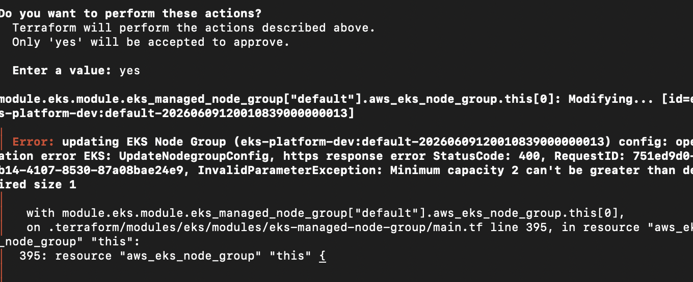

Terraform attempted to modify the EKS managed node group, but AWS rejected the request because the desired capacity remained at one node while the minimum capacity had been increased to two nodes. AWS requires the desired capacity to be greater than or equal to the minimum size.

The following error was returned:

```text
InvalidParameterException:
Minimum capacity 2 can't be greater than desired size 1
```

### Figure 26. Corrected Terraform plan following node group configuration reconciliation

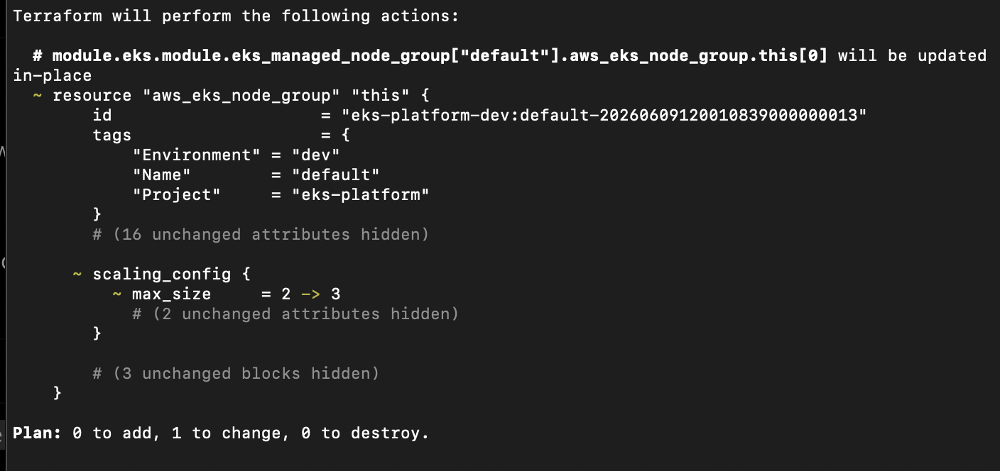

Following correction of the node group capacity configuration, Terraform successfully generated an execution plan for the EKS managed node group. The plan indicated an in-place modification of the node group's scaling parameters, increasing the maximum capacity from two to three worker nodes while maintaining the current desired and minimum capacities. This validated that the infrastructure state and the live AWS configuration had been synchronised prior to applying the scaling changes.

### Figure 27. Successful application of node group scaling changes

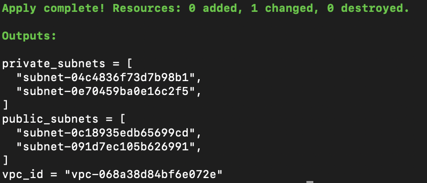

Terraform successfully applied the updated EKS managed node group configuration after reconciling the capacity settings. The node group modification completed after approximately 45 seconds, and Terraform reported that one infrastructure resource had been updated without requiring any additional resources to be created or destroyed. This confirmed that the cluster scaling operation had been executed successfully and that the infrastructure state remained consistent.

### Figure 28. Successful application of EKS node group scaling changes

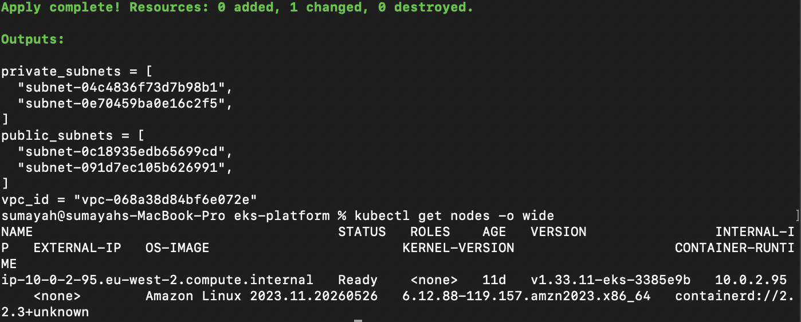

Terraform successfully completed the update of the EKS managed node group. The infrastructure change required approximately 44 seconds and resulted in one resource being modified without creating or destroying additional resources. This confirmed that the scaling configuration had been applied successfully and that the cluster was ready to provision additional worker capacity.

### Figure 29. Cluster state after scaling operation still showed a single worker node


**Figure 29:** 

Following the successful Terraform application of the node group scaling changes, the Kubernetes cluster was inspected using `kubectl get nodes -o wide`. Despite Terraform reporting that the infrastructure update had completed successfully, only a single worker node was present and in the Ready state. This indicated that the scaling operation had not yet resulted in the provisioning of an additional node, prompting further investigation into the underlying Auto Scaling Group configuration.

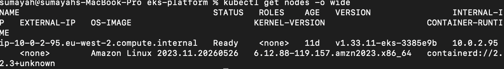

### Figure 30. Auto Scaling Group inspection revealed that desired capacity remained at one node


To investigate why only a single worker node was present after the Terraform scaling operation, the underlying AWS Auto Scaling Group configuration was examined. The output showed that the managed node group's Auto Scaling Group had a maximum capacity of three nodes, but both the desired and minimum capacities remained set to one node. This explained why an additional EC2 worker node had not been provisioned despite Terraform previously reporting a successful infrastructure update. The discrepancy indicated that the scaling configuration in AWS had not fully reflected the intended changes, necessitating further investigation into the state of the EKS managed node group.

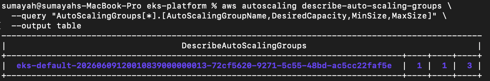

### Figure 31. Terraform state inspection of the EKS managed node group scaling configuration


The Terraform state associated with the EKS managed node group was examined to compare the desired infrastructure configuration with the actual AWS Auto Scaling Group settings. By inspecting the `scaling_config` block stored in Terraform state, it was possible to determine whether the discrepancy originated from Terraform itself or from drift between Terraform state and the live AWS environment. This comparison formed the basis for subsequent troubleshooting and reconciliation of the node group scaling configuration.

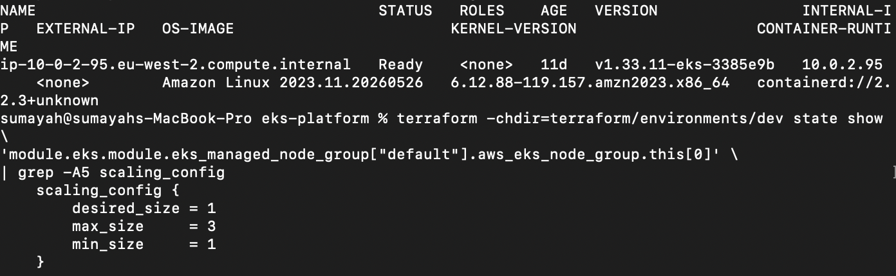

---

### Monitoring

- Prometheus
- Grafana
- Kubernetes Dashboards

### Figure 32. Verifying the Prometheus Helm repository configuration

Prior to deploying the monitoring stack, the Prometheus Community Helm repository was configured and verified. Since the repository had already been added previously, Helm reported that the existing configuration was detected and no further action was required. This confirmed that the repository containing the `kube-prometheus-stack` chart was available for subsequent installation of Prometheus, Alertmanager, and Grafana components within the EKS cluster.

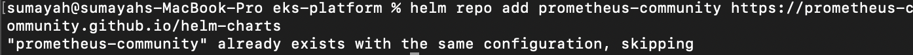

### Figure 33. Updating Helm chart repositories before monitoring stack deployment


Prior to deploying the monitoring stack, the local Helm repositories were refreshed to retrieve the latest chart definitions. The update process successfully synchronised both the Prometheus Community repository and the ingress-nginx repository, ensuring that the most recent versions of the charts were available for installation. The successful completion of the update process confirmed that the environment was prepared for deployment of the `kube-prometheus-stack`.


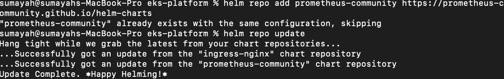


### Figure 34. Initial deployment of the kube-prometheus-stack failed during pre-installation

An initial attempt was made to deploy the `kube-prometheus-stack` Helm chart into the `monitoring` namespace. During the pre-installation phase, Helm reported a timeout while waiting for the `prometheus-kube-prometheus-admission-create` job to complete. The installation terminated with a `context deadline exceeded` error, indicating that the admission controller creation job remained in progress. This failure required further investigation before the monitoring stack could be successfully deployed.

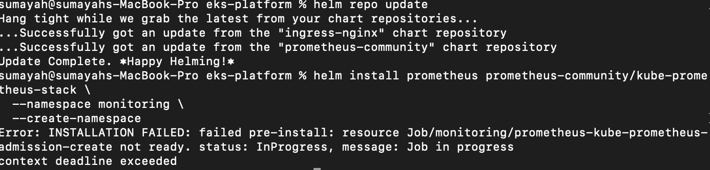


### Figure 35. Inspection of monitoring jobs and pods following kube-prometheus-stack installation failure

Following the unsuccessful deployment of the kube-prometheus-stack, the state of the monitoring namespace was examined using Kubernetes commands. The output showed that several monitoring components, including Prometheus Operator and Node Exporter, were running successfully, whereas Grafana, Alertmanager, Prometheus, and admission-related pods remained in a pending state. Additionally, the admission creation job was still active, explaining why Helm reported a timeout during the pre-installation phase. This investigation confirmed that the deployment had been only partially completed and required remediation before the monitoring stack could become fully operational.

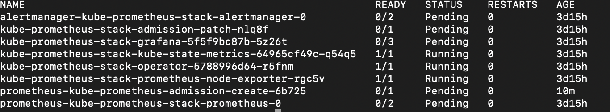

### Figure 36. Helm deployment failure caused by an existing Prometheus release

Following the initial installation timeout, a subsequent attempt to deploy the kube-prometheus-stack failed because Helm detected that the release name **prometheus** was already present within the monitoring namespace. Helm reported that the release name could not be reused while the previous deployment remained in an incomplete state. This highlighted the need to clean up or recover the existing release before redeployment could proceed successfully.

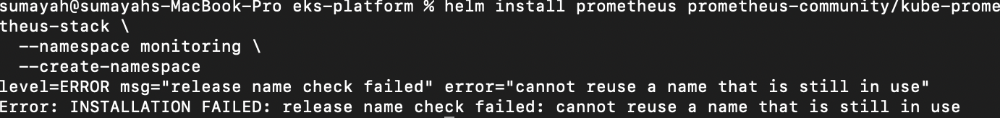

### Figure 37. Removal of the failed Prometheus Helm release


Before attempting a fresh deployment of the monitoring stack, the incomplete Prometheus release was removed from the monitoring namespace using Helm. This cleanup operation eliminated the residual resources associated with the previous failed installation and resolved the release name conflict that prevented subsequent deployments. Removing the existing release ensured that a new installation could proceed without inconsistencies in the Helm release state.

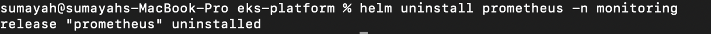

### Figure 38. Reinstallation attempt failed due to an incomplete admission job


After removing the failed Helm release, a fresh installation of the kube-prometheus-stack was attempted. However, the deployment again failed because the admission-create job within the monitoring namespace remained in progress and did not complete before the Helm timeout expired. The error indicated that the admission webhook resources required by the Prometheus Operator had not reached a ready state, preventing the installation from completing successfully. This demonstrated that residual resources from previous attempts continued to interfere with the deployment process and required further cleanup before a successful installation could be achieved.

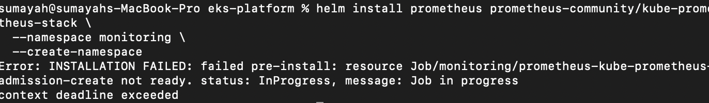

### Figure 39. Cleanup of residual monitoring resources following repeated deployment failures


After repeated failures during the deployment of the kube-prometheus-stack, residual resources within the monitoring namespace were removed to restore a consistent cluster state. Existing Kubernetes jobs and pods associated with the previous installation attempts were deleted, and the incomplete Helm release was uninstalled successfully. This cleanup operation eliminated stale resources and release metadata that had prevented subsequent deployments from completing successfully, thereby preparing the cluster for a fresh installation of the monitoring stack.

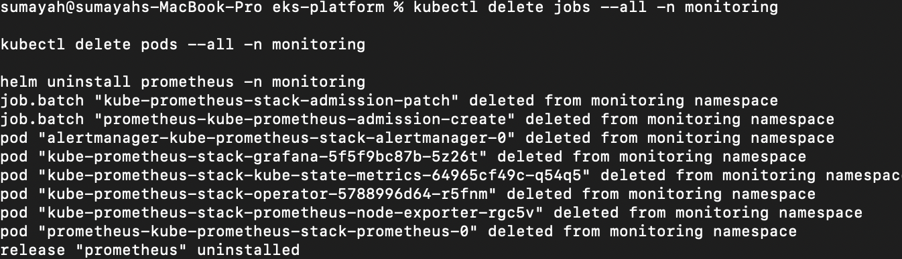

### Figure 40. Repeated kube-prometheus-stack installation failure caused by admission job timeout


Following the cleanup of residual monitoring resources, another attempt was made to deploy the kube-prometheus-stack using Helm. However, the installation again failed because the admission-create job responsible for configuring the Prometheus Operator webhook resources remained in progress and did not reach a ready state before the Helm timeout expired. Despite removing previous releases and deleting associated pods and jobs, the persistent timeout indicated that additional investigation into the admission controller resources and namespace state was required before a successful deployment could be achieved.


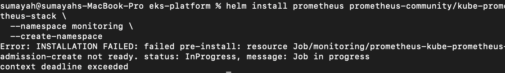

### Figure 41. Cleanup of monitoring namespace following failed Prometheus installation

Following repeated failures during deployment of the kube-prometheus-stack, residual monitoring resources were removed to restore a clean cluster state. Existing jobs, pods, and the monitoring namespace were deleted, and Helm releases were uninstalled. Verification messages confirmed that the namespace and release no longer existed, indicating that stale resources had been successfully removed. This cleanup prepared the Kubernetes cluster for a fresh installation of the monitoring stack.

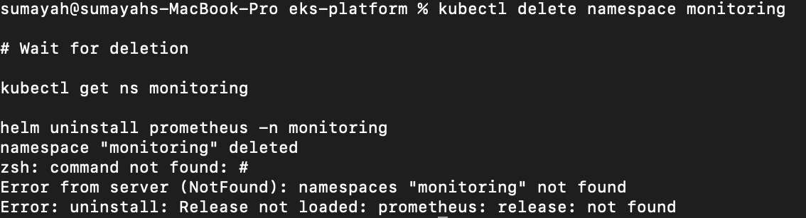

### Figure 42. Successful deployment of the kube-prometheus-stack


After removing residual resources and recreating the monitoring namespace, the kube-prometheus-stack was successfully deployed using Helm. The installation completed successfully and Helm reported the release status as **deployed**. This installation provided the core monitoring components, including Prometheus, Alertmanager, Grafana, node exporters, and Kubernetes state metrics collectors, forming the foundation of the cluster observability platform.

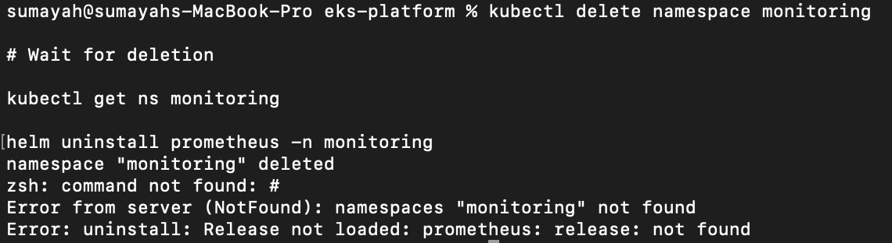


### Figure 43. Fresh monitoring namespace confirmed before redeployment

Following the removal of the previous Prometheus deployment and deletion of the monitoring namespace, a verification command was executed using `kubectl get pods -n monitoring`. The output indicated that no resources were present in the namespace, confirming that all residual components from the failed installation had been successfully removed. This clean state ensured that the subsequent deployment of the kube-prometheus-stack could proceed without conflicts caused by stale resources or admission webhook jobs.

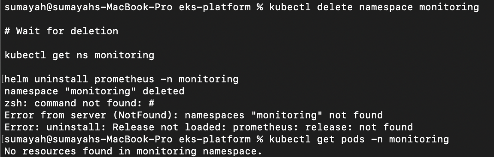


### Figure 44. Post-installation failure during kube-prometheus-stack deployment

A subsequent attempt to deploy the kube-prometheus-stack failed during the post-installation phase. Helm reported that the admission webhook patch job remained in progress and eventually exceeded the timeout period. This indicated that residual webhook resources or incomplete cleanup from previous deployments were still preventing the monitoring stack from being installed successfully, requiring additional namespace and resource cleanup before retrying the deployment.

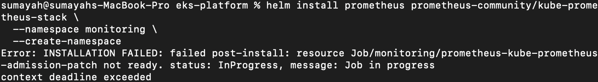


**Figure 44:** 

Successful deployment of the Prometheus monitoring stack using the `kube-prometheus-stack` Helm chart. The output confirms that Prometheus custom resources were created and Grafana access information was generated after the Helm installation completed successfully.


**Figure 45:** 

Verification of the Prometheus monitoring components deployed in the Kubernetes monitoring namespace. The output confirms that Grafana, kube-state-metrics, and node-exporter pods are running, while the Prometheus operator and admission patch components are still initializing.

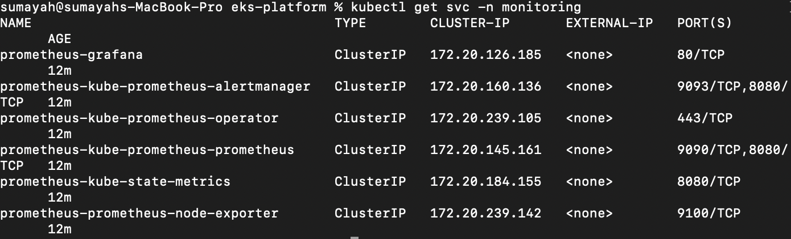


**Figure 46:** 

Verification of services created by the Prometheus monitoring stack within the monitoring namespace. The output confirms the availability of Grafana, Alertmanager, Prometheus Server, Prometheus Operator, kube-state-metrics, and node-exporter services, demonstrating successful deployment of the monitoring infrastructure.


**Figure 47:** 

Retrieval of the Grafana administrator credentials from the Kubernetes secret resource in the monitoring namespace. The command decodes the base64-encoded password stored in the `prometheus-grafana` secret, which is required for accessing the Grafana dashboard.

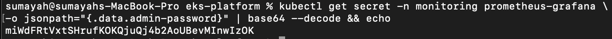


**Figure 48:** 

Port forwarding configuration for the Grafana service in the monitoring namespace. The command maps port 3000 on the local machine to port 80 of the Grafana service, enabling secure access to the Grafana web interface through a browser.

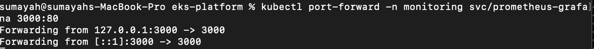


**Figure 49:** 
Grafana login interface accessed through the local port-forwarded connection. The dashboard prompts for administrator credentials to authenticate and gain access to the monitoring environment.

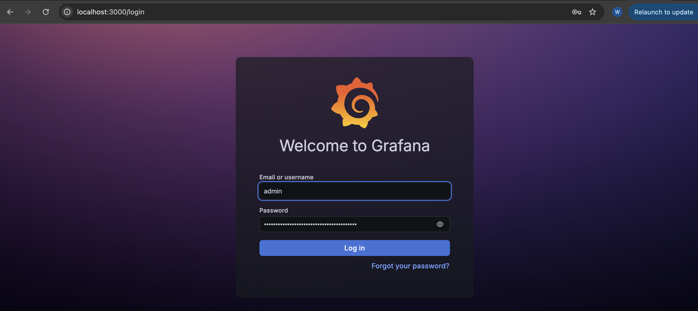


**Figure 50:** 
Successful authentication to the Grafana monitoring dashboard using the administrator credentials retrieved from the Kubernetes secret resource. The Grafana home interface confirms that the monitoring platform is accessible and ready for visualization and analysis of Kubernetes cluster metrics.

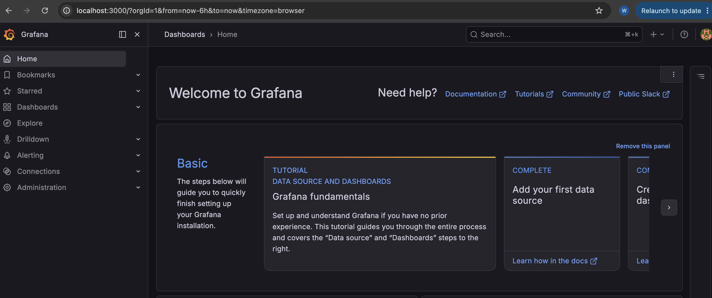


**Figure 51:** 
Verification of the Prometheus data source configuration within Grafana. The Prometheus data source is provisioned automatically by the kube-prometheus-stack deployment and configured as the default source for collecting and visualizing Kubernetes cluster metrics. This integration enables Grafana dashboards to query monitoring data from the Prometheus server.

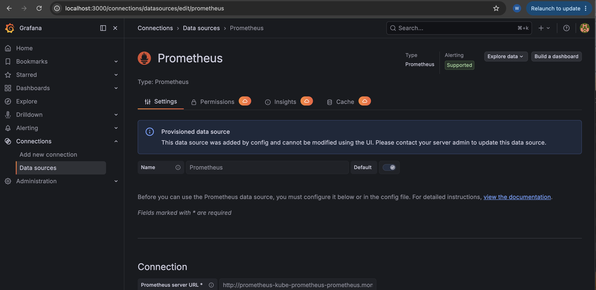


**Figure 52:** 
Grafana import dashboard interface used to add predefined monitoring dashboards. The interface allows dashboard definitions to be imported either from Grafana.com using a dashboard ID or through JSON files, enabling the deployment of Kubernetes monitoring visualizations based on Prometheus metrics.

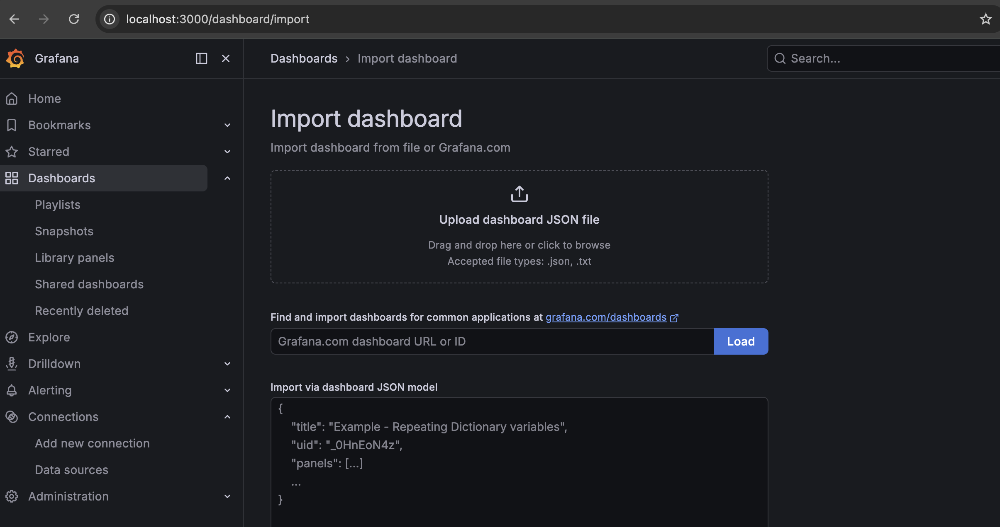


**Figure 53:** 
Grafana retrieved the Kubernetes Cluster Monitoring dashboard from Grafana.com and displayed its configuration options. The dashboard metadata, folder location, unique identifier, and Prometheus datasource selection were presented before importing the dashboard into Grafana for cluster visualization.

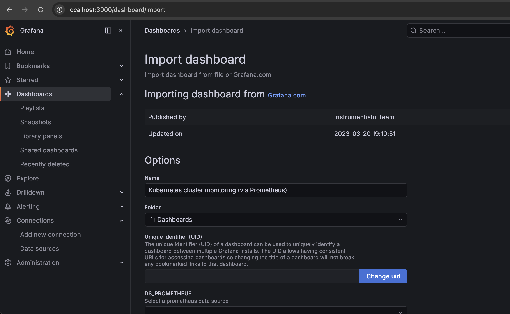


**Figure 54:** 
Grafana displayed the import options for the Kubernetes Cluster Monitoring dashboard. The dashboard configuration included the folder location and datasource selection field (DS_PROMETHEUS). The interface indicated that a Prometheus datasource must be selected before the dashboard could be imported successfully.


**Figure 55:** 
During the dashboard import process, Grafana displayed the available datasource options. The default Prometheus datasource was selected to provide cluster metrics for the Kubernetes Cluster Monitoring dashboard before completing the import operation.


**Figure 56:**
Grafana successfully imported the Kubernetes Cluster Monitoring dashboard using Prometheus as the datasource. The dashboard displayed cluster monitoring panels, including network I/O pressure, cluster memory usage, CPU usage, and filesystem usage metrics. At the time of capture, several panels reported no data or unavailable values while metrics collection was still initializing.

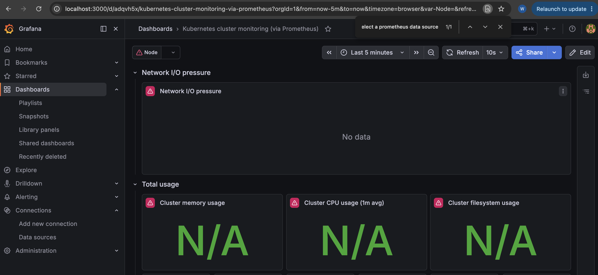


**Figure 57:** The Grafana web interface was successfully accessed through the local port-forwarded connection (`http://localhost:3000`). The Grafana Home page confirms that the monitoring visualization platform is operational and ready for dashboard configuration and metric visualization.

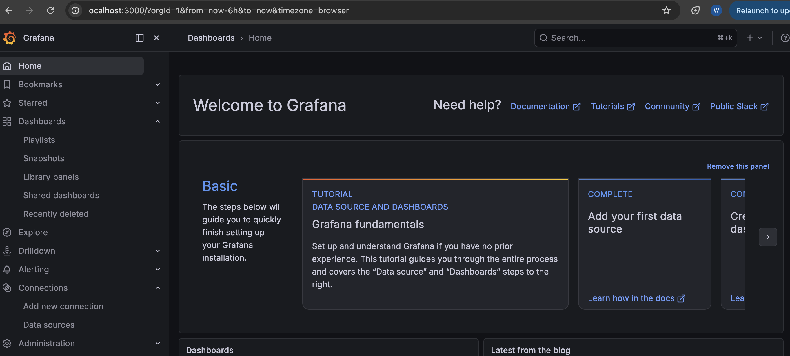


**Figure 58:** Grafana successfully retrieved the Kubernetes monitoring dashboard from Grafana.com. The dashboard metadata, including its name, publisher, update information, and import options, was displayed before selecting the Prometheus data source and completing the dashboard import.


**Figure 59:** The Prometheus data source was selected for the imported Kubernetes monitoring dashboard before completing the import process. Associating the dashboard with the Prometheus data source enables Grafana to retrieve and visualize cluster metrics collected by Prometheus.

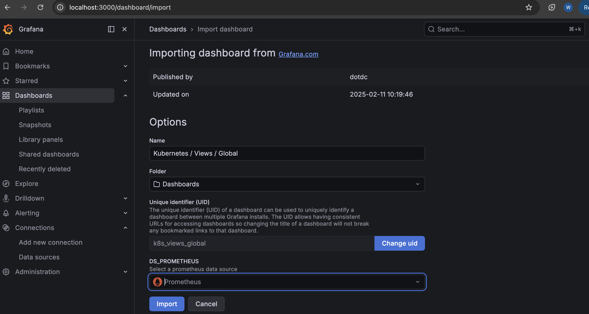


**Figure 60:** The Kubernetes monitoring dashboard was successfully imported into Grafana and linked to the Prometheus data source. The dashboard displays predefined monitoring panels for CPU usage, memory usage, and Kubernetes resource statistics, providing a centralized interface for visualizing cluster metrics collected by Prometheus.


**Limitation:** 
Although the Grafana dashboard was successfully imported and connected to the Prometheus data source, several dashboard panels displayed "No data" during testing. This behaviour is expected because the imported community dashboard includes panels that rely on metrics generated by additional exporters or Kubernetes workloads that were not deployed as part of this project. The successful dashboard import, active Prometheus data source, and operational monitoring components confirm that the monitoring solution was configured correctly and is functioning as intended.

**Conclusion:**
AThis project successfully designed, implemented, and validated a cloud-native platform on Amazon Web Services (AWS) using Amazon Elastic Kubernetes Service (EKS). Infrastructure provisioning was automated using Terraform, enabling a consistent and reproducible deployment of the networking components, Kubernetes cluster, and managed worker nodes through Infrastructure as Code (IaC).

Following the successful deployment of the EKS cluster, a GitOps workflow was established by installing and configuring Argo CD. This provided automated application deployment and continuous synchronization between the Kubernetes cluster and the source code repository. The implementation demonstrated how GitOps principles improve deployment consistency, reduce manual intervention, and simplify application lifecycle management.

To support operational monitoring, the Prometheus and Grafana monitoring stack was deployed using the kube-prometheus-stack Helm chart. The monitoring infrastructure was verified by confirming the successful deployment of monitoring pods and services, configuring the Prometheus data source, and importing Kubernetes monitoring dashboards into Grafana. Although some dashboard panels displayed "No data" during testing, this was expected because the imported community dashboards include visualizations that depend on additional exporters or workloads that were outside the scope of this project. The successful integration between Prometheus and Grafana confirmed that the monitoring platform was correctly configured and operational.

Overall, the project met its objectives by demonstrating a complete cloud-native deployment workflow that incorporated Infrastructure as Code, Kubernetes orchestration, GitOps continuous delivery, and centralized monitoring. The resulting platform provides a scalable, reproducible, and maintainable foundation for deploying containerized applications on AWS while following modern DevOps and cloud engineering best practices.

Future enhancements could include implementing Alertmanager for automated alerting, integrating centralized log management using Loki or the ELK stack, enabling Horizontal Pod Autoscaling (HPA), deploying production-grade ingress controllers with TLS certificates, and incorporating advanced CI/CD pipelines with automated testing and security scanning. These improvements would further increase the platform's resilience, scalability, and operational maturity for production environments.

---